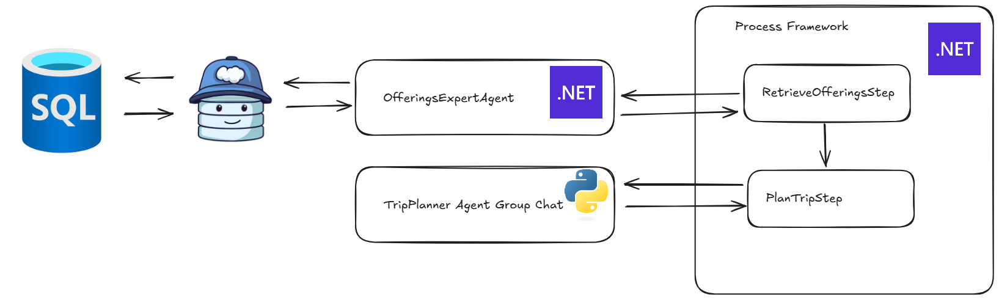

This demo is based upon the [Process Framework with .NET Aspire demo](https://github.com/microsoft/semantic-kernel/tree/main/dotnet/samples/Demos/ProcessFrameworkWithAspire).

In this sample I explore the ability to use different coding languages to build our agents and have them communicate with each other.

The sample is built using the following technologies:

- [Semantic Kernel](https://learn.microsoft.com/en-us/semantic-kernel/)
- [Data API Builder](https://learn.microsoft.com/en-us/azure/data-api-builder/): an open source tool to build APIs on top of databases.
- [.NET Aspire](https://learn.microsoft.com/en-us/dotnet/aspire/get-started/aspire-overview)

## Process workflow

The involved microservices are:
- [Process Orchestrator](./src/TravelAgency.ProcessOrchestrator/Program.cs): this is a .NET minimal API that orchestrates the process, using Semantic Kernel Process Framework.
- [Offerings Expert Agent](./src/TravelAgency.OfferingsExpert/Program.cs): this is a .NET minimal API that retrieves the offerings from the database, using Data API Builder as a plugin for its [ChatCompletionAgent](./semantic-kernel/prompts/offering_expert_instructions.txt). For further details on how to use Data API Builder as a plugin, please refer to the [this blog](https://dev.to/tommasodotnet/net-aspire-for-data-chatting-3ghe).
- [Trip Planner Agent](./src/trip-planner/src/trip_planner/__init__.py): this is a Python microservice that will plan the trip based on the offerings retrieved by the Offerings Expert Agent and the user request. This uses an Agent Group Chat with two agents: [Travel Manager](semantic-kernel/prompts/travel_manager_instructions.txt) and [Travel Agent](./semantic-kernel/prompts/travel_agent_instructions.txt).

The process workflow is as follows:
1. The user sends a request to the [Process Orchestrator](./src/TravelAgency.ProcessOrchestrator/Program.cs).
2. The Process Orchestrator starts a new process
3. The first step is the RetrieveOfferingsStep, which will invoke the [Offerings Expert Agent](./src/TravelAgency.OfferingsExpert/Program.cs) to retrieve the offerings.
4. The second step is the PlanTripStep, which will invoke the [Trip Planner Agent](./src/trip-planner/src/trip_planner/__init__.py) to plan the trip.